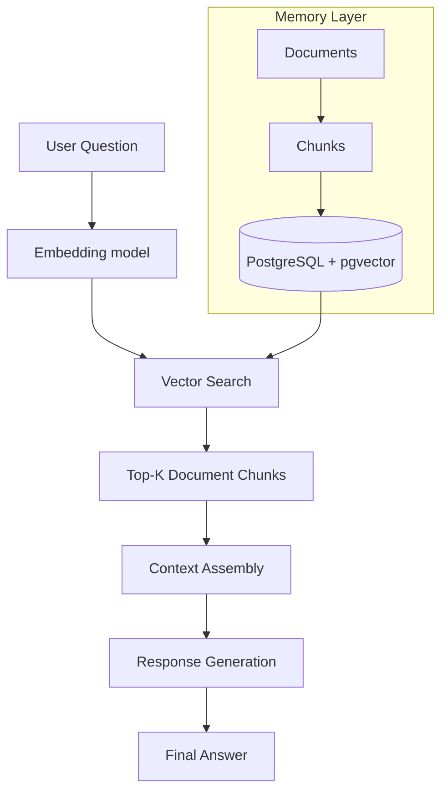

# 🧠 Life OS

> A personal AI memory layer built on Rails, pgvector, and OpenAI.  
> Turns your life into queryable, structured, semantic memory.

---

<div align="center">


### 🧠 Personal AI Memory System  
*RAG-based assistant for querying your life data in natural language*

</div>

---

# ✨ Overview

Life OS is a **personal AI memory system** that allows you to store, retrieve, and reason over your life using natural language.

It combines:

> 📚 Structured personal data (logs, recipes, plans)<br>
> 🧠 Vector embeddings for semantic retrieval<br>
> 🤖 LLM reasoning over retrieved context<br>
> ⚡ Rails-backed production architecture<br>

---

# 🧭 Core Experience

Instead of searching notes or calendars, you ask:

- “What did I do today?”
- “When does Mom arrive?”
- “What are my favorite recipes?”
- “What groceries do I usually buy?”

And receive grounded, contextual answers from your own memory.

---

# 🧱 System Architecture

## High-Level Flow



#### User Question  
→ Embed Query (OpenAI: text-embedding-3-small)<br>
→ Vector Search (PostgreSQL + pgvector)<br>
→ Retrieve Top-K Relevant Chunks<br>
→ Assemble Context Window<br>
→ Generate Response (GPT-4o)<br>
→ Return Final Answer<br>

---

## 📚 Document Layer

| Type | Examples |
|------|----------|
| 📓 Daily Logs | Work, activities, meals |
| 🍳 Recipes | Personal favorites |
| 🛒 Grocery | Baseline list |
| 📅 Itineraries | Travel plans |
| 💻 Projects | Life OS progress |
| 🩺 Medical | Health notes |

Each document:

```ruby
title
content
doc_type
metadata
```

---

## ✂️ Chunking Layer

- Preserves context boundaries
- Improves embedding accuracy
- Enables semantic search

Each chunk:
```ruby
content
embedding
document_id
```

---

## 🧠 Embedding Layer

- Model: text-embedding-3-small
- Stored in PostgreSQL via pgvector
- Enables cosine similarity search

---

## 🔍 Retrieval Layer (RAG)

1. Embed query
2. Vector search
3. Retrieve top chunks
4. Assemble context
5. Send to GPT-4o

---

## 🤖 Generation Layer

GPT-4o is instructed to:

- use only retrieved context
- avoid hallucinations
- stay grounded in memory

---

## 🧭 Smart Routing Layer
```ruby
case question.downcase
when /recipe/
  # recipe filter
when /grocery/
  # grocery filter
when /doctor/
  # medical filter
when /trip || vacation/
  # itinerary filter
end
```

---

## 📓 Daily Memory System

Each daily log includes:

- Work
- Activities
- Meals
- Projects
- Notes

Creates a time-indexed memory stream.

---

## 🧪 Example Queries

#### “What did I do today?”
- Work summary  
- Activities  
- Meals  
- Projects  

---

#### “What are my favorite recipes?”
- Blueberry Collagen Smoothie  
- Peanut Butter Marshmallow Kix Bars  

---

#### “What groceries do I usually buy?”
- Grocery baseline list  

---

#### “When does Mom arrive?”
- Itinerary-based response  

---

## 🧠 Design Philosophy

- Memory-first architecture  
- Semantic over structural search  
- Incremental intelligence  
- Real-world utility over demos  

---

## 🚧 Known Limitations

- Keyword routing is simplistic  
- No entity graph yet  
- No summarization layer  
- No temporal reasoning  
- No proactive behavior  

---

## 🧭 Roadmap

### Phase 1
- LLM intent classification  
- Hybrid ranking  
- Entity extraction  

---

### Phase 2
- Weekly summaries  
- Pattern detection  
- Change tracking  

---

### Phase 3
- Planning assistant  
- Proactive suggestions  

---

### Phase 4
- Memory graph  
- Relationship modeling  
- Timeline reconstruction  

---

## ⚙️ Setup

```bash
bundle install
rails db:create db:migrate
rails server
```

---

## ⚙️ Environment

```bash
OPENAI_API_KEY=your_key
```

## 📊 Status

- RAG pipeline: ✅  
- Data ingestion: ✅  
- Multi-domain memory: ✅  
- Semantic retrieval: ✅  
- Daily usage: ⚡ active  

---

## 🧠 Vision

A personal AI memory layer that lets you query your life like a database.

Not a chatbot.  
Not a notes app.  
A living memory system.

---

## 🚀 Current State

- MVP → working RAG system  
- Next → memory intelligence layer  
- Future → full personal AI agent  